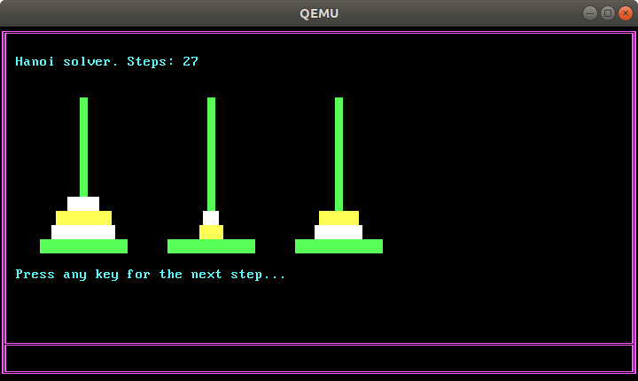
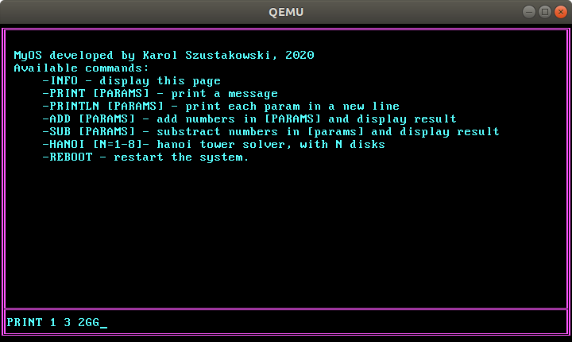

# ASMOS
My approach to writing a simple operating system using ASM only

It is a project that helped me learn a bit about the hardware I'm working on.
The OS loads a GDT, enables A20 line etc. and boots up to show 
a simple prompt. It offers some small programs. 
The OS is using text mode, since I wanted to keep this project small
and not use additional charmaps.

Here are some screenshots from the OS:
Hanoi tower solver program:

And the information panel:

Anyone interested in developing an OS - feel free to contact me, I will help if I can 
